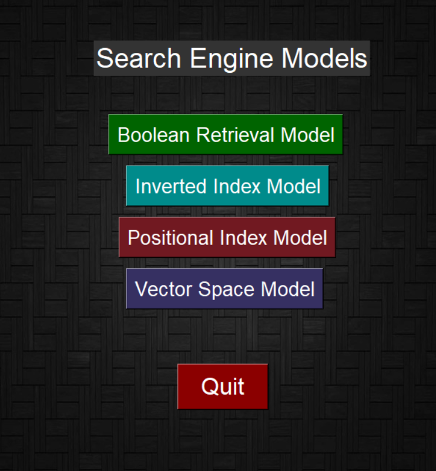
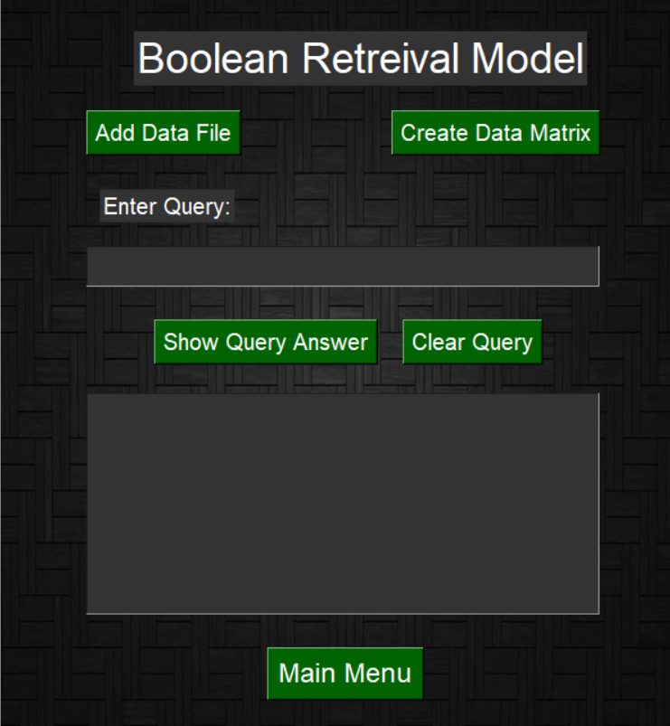
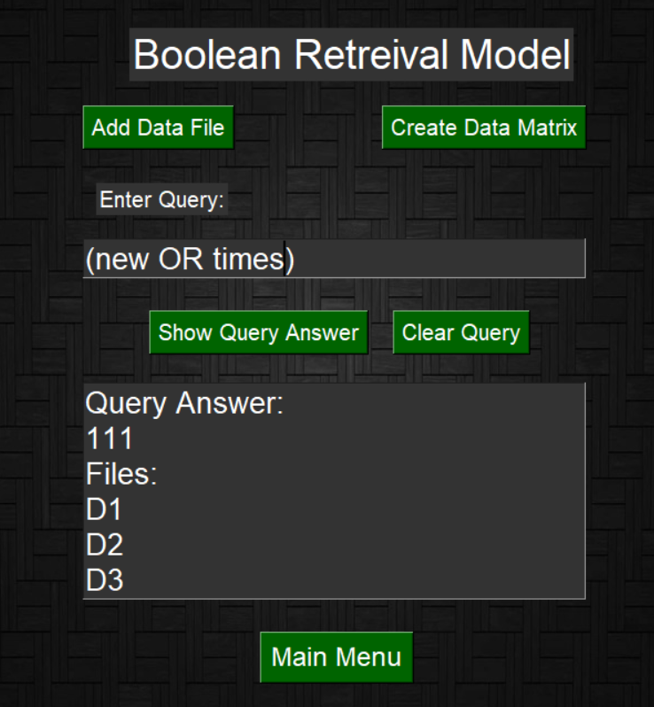
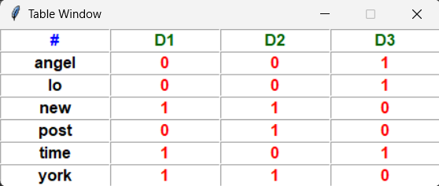

# This Project aims to help in searching Text documents using an IR System.

# # The System Consists of 4 Model:<br>
<b>1 - Boolean Retrieval Model</b><br>
<b>2 - Inverted Index Model</b><br>
<b>3 - Positional Index Model</b><br>
<b>4 - Vector Space Model</b><br>
<br>
# # Main Menu:<br>
<br>
<br>
# # Boolean Retrieval Model:<br>
<b>This Model uses Boolean Algebra to search in text files and represent data in text file using data Matrix.</b><br>
<br>
<br>
<br>
# # Steps to use this Model:<br>
```c++
1 - Add "your text files" using the "Add Data File" Button.
2 - Create Data Matrix to represent every word in "your text files" using the "Create Data Matrix" Button.
3 - Enter your Boolean Query in "Enter Query" textbox:
    you have 3 Boolean Operators (AND, OR, NOT)
    Ex-1 : ("your first search word" AND "your second search word")
    Ex-2 : ("your first search word" OR "your second search word")
    Ex-3 : (NOT "your search word")
    some Notes:
      1. You can have complex Queries like this "((NOT ahmed) AND (play OR eat))".
      2. Remember to add brackets around every operation you made.
      3. Boolean Operators must be written in Capital.
4 - Click on "Show Query Answer" Button to show the output of the query:
    output consists of 2 things:
    first -> binary string -> it's length represents the number of your files and in the order you entered them
                           -> 0 means that this file doesn't have the data that satisfies your query.
                           -> 1 means that this file has the data that satisfies your query.
5 - Click on "Clear Query" Button to Clear "Enter Query" textbox and output textbox.
```
# # Example:<br>
<b>Input:<b>
```c++
(new OR times)
```
<b>Output:</b><br>
```c++
Query Answer:
111
Files:
D1
D2
D3
```
<br>
# # Data Matrix from the example:<br>
<br>
<br>
# # Inverted Index Model:<br>
<b>In Boolean Retrieval model we faced a problem with the size of Data Matrix table</b><br>
<b>which contains 1 if the word in the file and 0 if the is not in the file</b><br>
<b>and by simple obervation you realize that we don't care about 0 values because</b><br>
<b>it doesn't add any value to our search so we can store only positions where the value is 1</b><br>
<b>which makes our model more efficient and helps us focus on more important information like the positions and frequency of every word which called "Posted List"</b><br>
<br>
<b>and this model leads us to our second model which is "Inverted Index Model"</b><br>

<br>
<br>

